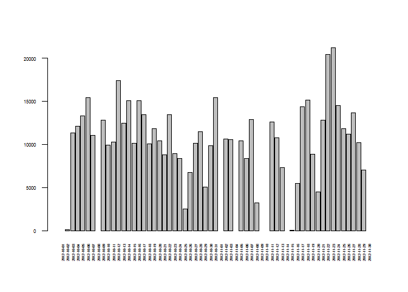
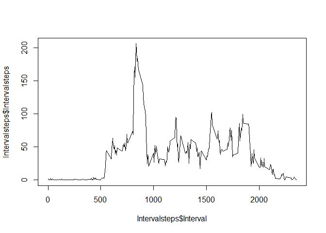
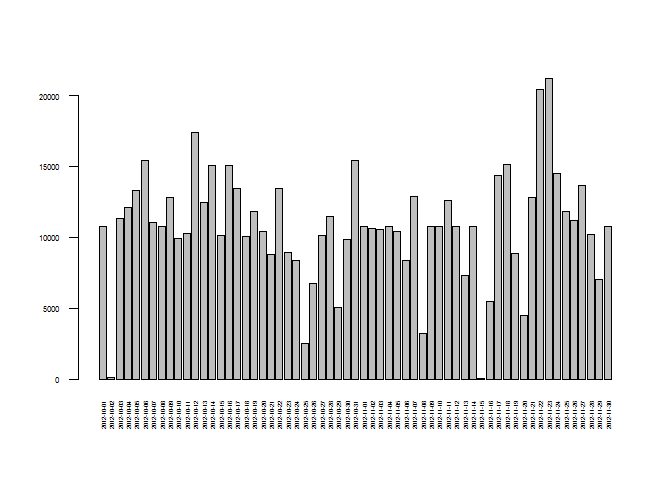
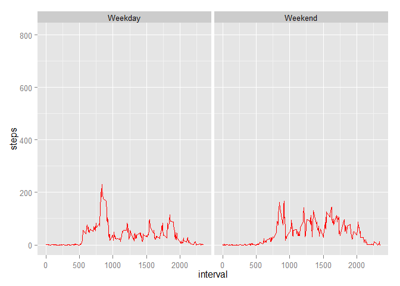

# Reproducible Research: Peer Assessment 1


Author: Pavitter Singh

## Loading and preprocessing the data

Load Data (It should be in your working directory)


```r
activitydata<-read.csv("activity.csv")
```

Transform data

```r
# Change format of date from Character to Date

activitydata$date<-as.Date(as.character(activitydata$date), "%Y-%m-%d")

# Transform data to calculate sum of steps by date

daysteps<-tapply(activitydata$steps, activitydata$date, sum)
daysteps<-as.data.frame(daysteps)
```

Make a Histogram of steps by date


```r
barplot(daysteps$daysteps, las=2, cex.axis=0.5, cex.name=0.4)
```

 

## What is mean total number of steps taken per day?

Calculate Mean of Total steps per day (Ignoring days where data is not available)


```r
mean1<-mean(daysteps$daysteps, na.rm=TRUE)
mean1
```

```
## [1] 10766.19
```

Median of Total steps per day (Ignoring days where data is not available)


```r
median1<-median(daysteps$daysteps, na.rm=TRUE)
median1
```

```
## [1] 10765
```


## What is the average daily activity pattern?

For average daily pattern We need to transform data for this analysis


```r
#Calculate mean of steps by interval

Intervalsteps<-tapply(activitydata$steps, activitydata$interval, mean, na.rm=TRUE)

# Add interval column with interval as Integer

Intervalsteps<-as.data.frame(Intervalsteps)
Intervalsteps$Interval<-rownames(Intervalsteps)
Intervalsteps$Interval<-as.integer(Intervalsteps$Interval)
```

Make a Time series plot of average steps by time interval of 5 mts


```r
plot(Intervalsteps$Interval, Intervalsteps$Intervalsteps, type="l")
```

 

To identify which interval has maximum average steps across days
Interval is:

```r
names(which.max(Intervalsteps$Intervalsteps))
```

```
## [1] "835"
```


## Imputing missing values

Count NAs (Where steps data is not available)
Count of rows is:

```r
length(which(is.na(activitydata$steps)))
```

```
## [1] 2304
```

Replace NAs with value of average steps in that interval across days and create a new dataset


```r
# Make a vector with rows where steps data is not available

narow<-which(is.na(activitydata$steps))

# Fill NA with average steps in that interval

for (i in narow) {
        interval1<-activitydata[i, 3]
       j<-which(Intervalsteps$Interval==interval1)
k<-Intervalsteps$Intervalsteps[j]
activitydata[i, 1]<-k
}
```

Transform data to create Histogram of Total Steps by day with new dataset


```r
daysteps1<-tapply(activitydata$steps, activitydata$date, sum)
daysteps1<-as.data.frame(daysteps1)
```

Make Histogram of new dataset


```r
barplot(daysteps1$daysteps1, las=2, cex.axis=0.5, cex.name=0.4)
```

 

Mean of new Dataset


```r
mean2<-mean(daysteps1$daysteps1, na.rm=TRUE)
mean2
```

```
## [1] 10766.19
```

Median of new Dataset


```r
median2<-median(daysteps1$daysteps1, na.rm=TRUE)
median2
```

```
## [1] 10766.19
```

Difference in Means (mean2-mean1)

```r
mean2-mean1
```

```
## [1] 0
```

Difference in Medians (median2-median1)

```r
median2-median1
```

```
## [1] 1.188679
```

There is not much of a difference after imputing data by interval average.


## Are there differences in activity patterns between weekdays and weekends?

Transform data as per requirement

```r
# get weekday of date

activitydata$Weekday<-weekdays(activitydata[, 2])

# add a column with any character data

activitydata$dayclass<-activitydata$Weekday

# add weekday classification in dayclass column
for (i in 1:17568){
        if(activitydata[i, 4]=="Saturday"){
                activitydata[i,5]<-"Weekend"
        }else{
                if(activitydata[i, 4]=="Sunday"){
                        activitydata[i, 5]<-"Weekend"
                }else{
                        activitydata[i, 5]<-"Weekday"
                }
        }
}
```

To make a panel plot library ggplot2

```r
library(ggplot2)
```

Draw plot that shows average steps by interval by weekdays and weekends.


```r
g<- ggplot(activitydata, aes(interval, steps))
g+ geom_line(alpha=0)+facet_grid(.~ dayclass)+stat_summary(fun.y=mean, fun.ymin=min, fun.ymax=max, col="red", geom="line")
```

 

In Weekends there is more activity than weekdays.
